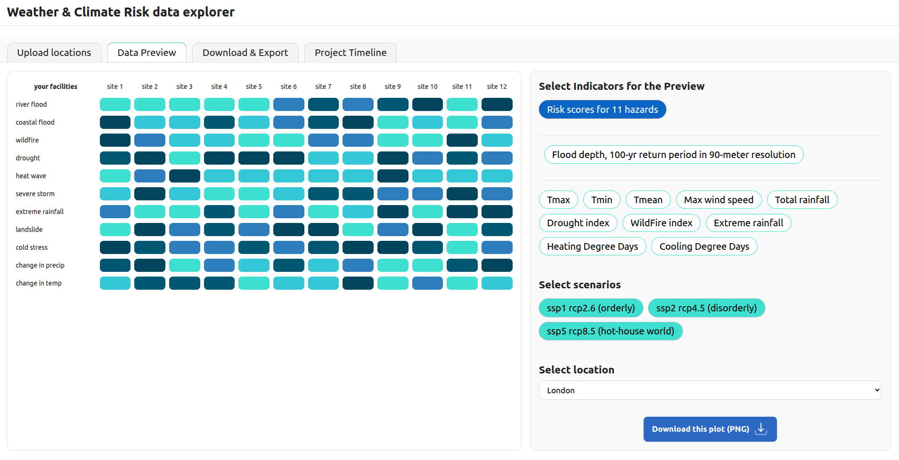
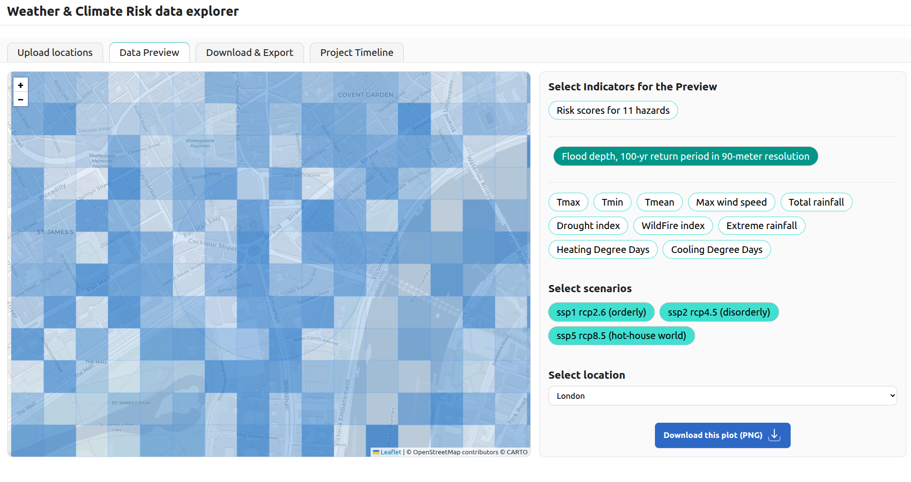

### Physical Climate Risk : data explorer DEMO tool 

This visualization tool works with WTN's climate data

You can use PyCharm or Terminal to run this project:

>> python -m http.server 8000

Then see it in your browser with live changes:
>> http://localhost:8000/ 

### To create a standalone HTML to run in any browser (no coding skills)
>> python make_single_file.py

Instant physical climate risk assessment : 
* asset level data analytics
* for any location worldwide 
* with the forward-looking scenario analysis
* with the historical "reference" risk assessment : what do we know?
* list of 11 hazards is aligned with the TCFD, IFRS S2, ESRS E1 and SB 261 + Green and sustainability taxonomy

Preview: detailed flood maps for any location:
* granularity : in 90 x 90 meter resolutions.
* default setting : flood depth [meters].

Frequency / probability : 100-year return period.

